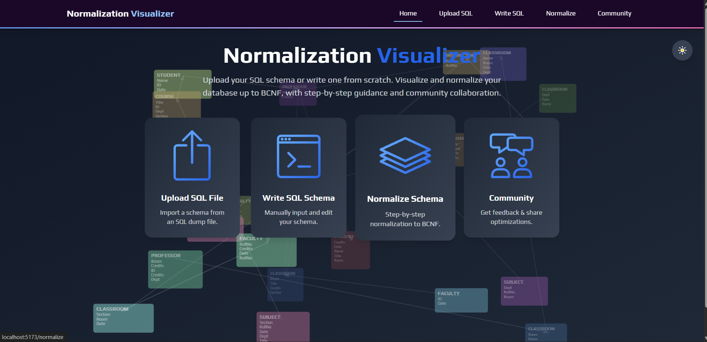
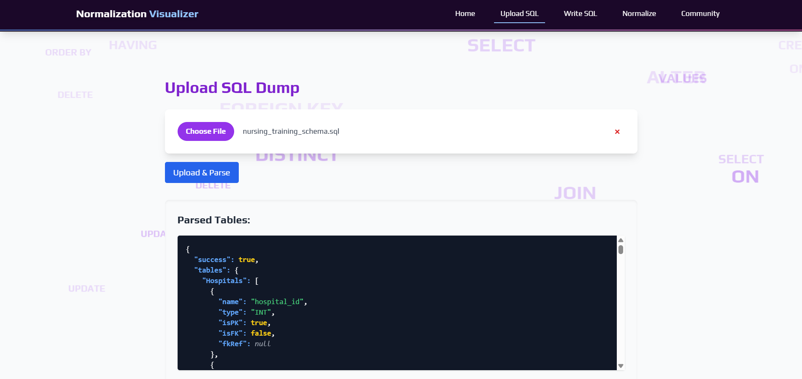
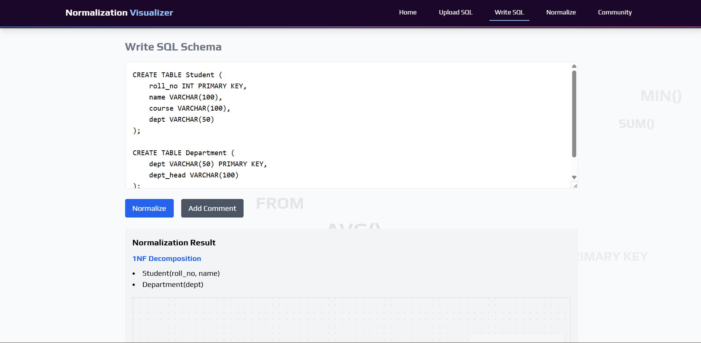
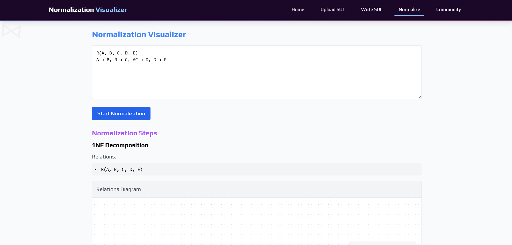
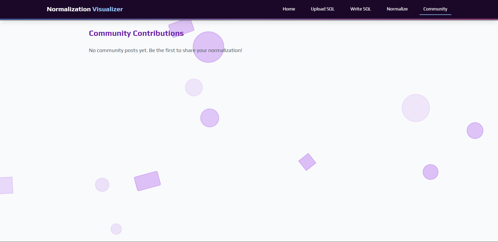

# Normalization Visualizer

A full-stack web application to **visualize and perform database normalization** with step-by-step explanations.  
Built using **Vite + React** (frontend) and **Node.js + PostgreSQL** (backend).  

---

## Features

- Real-time Schema Editing with collaborative comments (like Google Docs)
- SQL Dump Upload → Convert into ER diagram
- Functional Dependency Input → Auto-check normal forms (1NF → 4NF)
- Candidate Key and Canonical Cover Computation
- 3NF Synthesis and BCNF Decomposition Algorithms
- Step-by-Step Explanations for learning purposes
- Community Section where users can share optimization suggestions

---

## Project Structure

Normalization-Visualizer/
├── backend/ # Node.js + PostgreSQL backend
│ ├── routes/ # API routes (schema, normalization, community, etc.)
│ ├── models/ # DB models
│ ├── controllers/ # Business logic
│ └── server.js # Entry point
│
├── frontend/ # Vite + React frontend
│ ├── src/pages/ # Home, UploadSQL, WriteSQL, Normalize, Community
│ ├── src/components/ # UI Components
│ └── src/App.jsx # Main app entry
│
└── README.md

---

## Tech Stack

**Frontend:**  
- Vite + React  
- Tailwind CSS  
- Shadcn/UI components  

**Backend:**  
- Node.js + Express  
- PostgreSQL  
- SQL Parser + Normalization Logic  

---

## Getting Started

### Clone the repository
``bash
git clone https://github.com/swayamsid225/Normalization-Visualizer.git
cd Normalization-Visualizer

## Backend Setup
cd backend
npm install
npm start

The backend will start on http://localhost:5000

## Frontend Setup
cd frontend
npm install
npm run dev

The frontend will start on http://localhost:5173

## Community & Contributions

We welcome contributions.
Create issues for bugs and feature requests
Submit PRs with improvements
Share normalization suggestions in the Community page

## License

This project is licensed under the MIT License.

## Author

Swayam Sidgor
MANIT Bhopal
Email: swayamsid225@gmail.com
GitHub: swayamsid225

## Screenshots

### Home Page

### Upload SQL Page

### Write SQL Page

### Normalize Page

### Community Page

